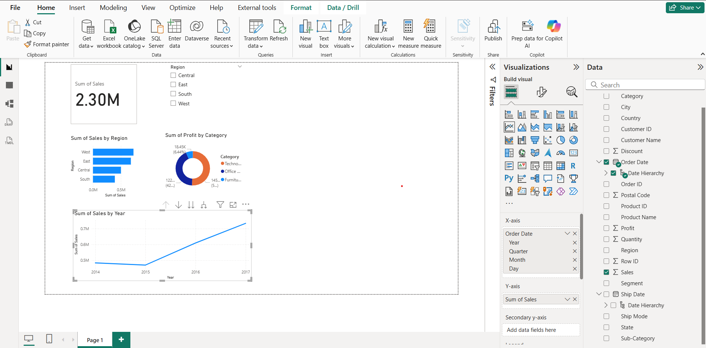

# Superstore Sales Dashboard — Power BI

An interactive business intelligence dashboard built in Power BI analyzing sales, profit, and regional performance of a retail superstore across 4 years of data.

---

## Dashboard Preview

---

## Business Questions Answered

- Which region generates the highest sales?
- How has revenue trended year over year?
- Which product category is most profitable?
- Where are the losses occurring?

---

## Visuals Included

| Visual | Type | Insight |
|--------|------|---------|
| Total Sales | KPI Card | $2.30M overall revenue |
| Sales by Region | Bar Chart | West leads all regions |
| Sales Trend (2014–2017) | Line Chart | Consistent year-on-year growth |
| Profit by Category | Donut Chart | Technology most profitable |
| Region Filter | Slicer | Interactive filter across all visuals |

---

## Key Insights

- **West region** contributes the highest sales among all 4 regions
- Sales show a **strong upward trend** from 2014 to 2017
- **Technology** is the most profitable category
- All visuals are **interactive** — filtering by region updates every chart simultaneously

---

## Tech Stack

- **Power BI Desktop**
- **DAX** — for calculated measures
- **Dataset** — Sample Superstore (Kaggle)

---

## Dataset

Sample Superstore dataset — publicly available on Kaggle.
Contains 9,994 rows of retail transaction data including orders, customers, products, sales, profit, and shipping details across the United States.

👉 [Download Dataset](https://www.kaggle.com/datasets/vivek468/superstore-dataset-final)

---

## Files in this Repo

| File | Description |
|------|-------------|
| `Superstore_Dashboard.pbix` | Power BI project file |
| `dashboard_preview.png` | Screenshot of the dashboard |
| `Superstore_Dashboard.pdf` | Exported PDF version |

---

## How to Open

1. Download and install [Power BI Desktop](https://powerbi.microsoft.com/en-us/desktop/) (free)
2. Clone this repo or download the `.pbix` file
3. Open `Superstore_Dashboard.pbix` in Power BI Desktop
4. Interact with the slicers and visuals

---

## Author

**Rakshaiya Yadav G**
- GitHub: [@Rakshaiya](https://github.com/Rakshaiya)
- Email: rakshaiya115@gmail.com
